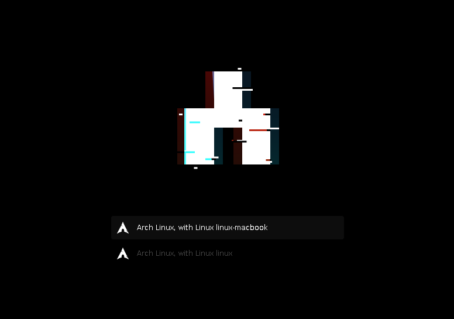

<p align='center'>
<br><br>
</p>

<h1 align='center'>
Bandersnatch GRUB theme
</h1>

<p align='center'>
Custom theme for the GRUB Linux boot loader
</p>

<p align='center'>

</p>

<br>

## Usage

- Git clone the repo somewhere, then `sudo make install` to copy files onto _/boot_.

  ```sh
  sudo make install
  ```

- Edit `/etc/default/grub` and change _GRUB_THEME_.

  ```sh
  # "sudo vim /etc/default/grub" - then add:
  GRUB_THEME="/boot/grub/themes/bandersnatch/theme.txt"
  ```

- Regenerate your GRUB config.

  ```sh
  # for Ubuntu, Manjaro, and some others:
  sudo update-grub

  # or for Arch Linux:
  sudo grub-mkconfig -o /boot/grub/grub.cfg
  ```

- Restart your computer.

  ```sh
  reboot
  ```

## References

Things were taken from other themes, thanks to these great projects!

- [Arch-Silence](https://github.com/fghibellini/arch-silence) by Filippo Ghibellini (progress bar)
- [Vimix](https://github.com/vinceliuice/grub2-themes) by Vince Liuice (icons, selection images)

## Thanks

If not explicitly stated otherwise all the files in this project are distributed under the [GNU General Public License](./COPYING).

> [ricostacruz.com](http://ricostacruz.com) &nbsp;&middot;&nbsp;
> GitHub [@rstacruz](https://github.com/rstacruz) &nbsp;&middot;&nbsp;
> Twitter [@rstacruz](https://twitter.com/rstacruz)

[](https://github.com/rstacruz) &nbsp;
[](https://twitter.com/rstacruz)
